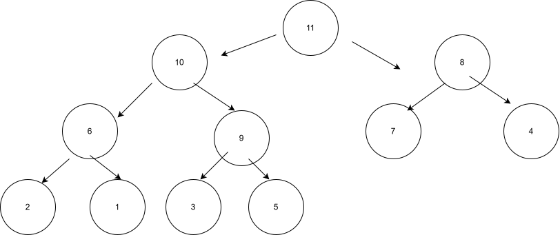
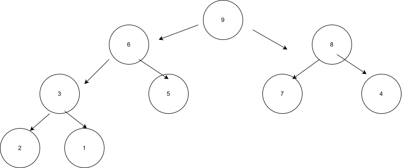
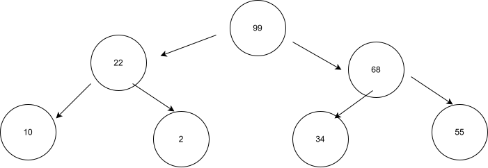

# Binary Heaps
## Objective
Implement binary heaps data structures in C++
## Tasks
#### 1. Draw what the following heap would look like after we insert the value 11 into it:

#### 2. Draw what the previous heap would look like after we delete the root node.

#### 3. Imagine you’ve built a brand-new heap by inserting the following numbers into the heap in this particular order: 55, 22, 34, 10, 2, 99, 68. If you then pop them from the heap one at a time and insert the numbers into a new array, in what order would the numbers now appear?
The array for the following heap would look like this:  
[99, 22, 68, 10, 2, 34, 55]  
The array stores the values of the heap from left to right moving down the rows.

